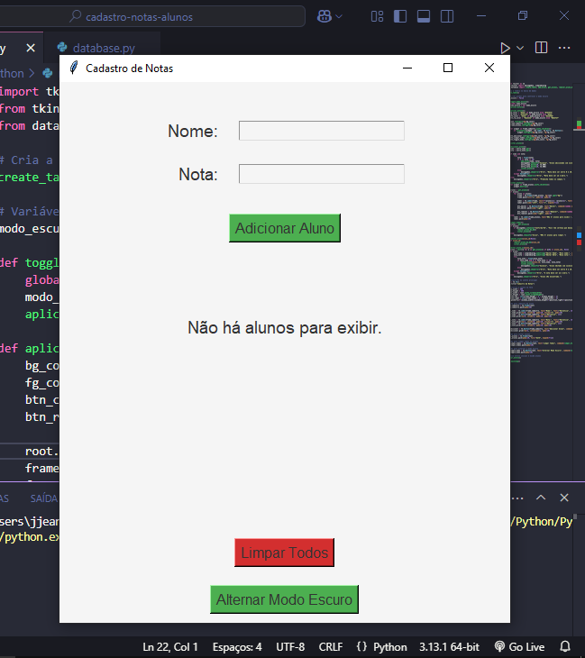

# Cadastro de Notas de Alunos

Este é um aplicativo simples para gerenciar o cadastro de alunos e suas notas, desenvolvido em **Python** com a interface gráfica feita em **Tkinter** e banco de dados **SQLite**.

## Funcionalidades

- Adicionar alunos com nomes e notas (de 0 a 10).
- Listar alunos com notas ordenadas.
- Editar o nome ou a nota de um aluno.
- Remover um aluno específico.
- Remover todos os alunos de uma vez.

## Demonstração

Abaixo está uma prévia da interface da aplicação:




## Tecnologias Utilizadas

- **Python** (versão 3.x)
- **Tkinter** (para a interface gráfica)
- **SQLite** (para o banco de dados local)

## Pré-requisitos

- Python 3 instalado no sistema.
- Biblioteca Tkinter (vem por padrão com o Python).

## Instalação e Configuração

1. Clone este repositório:
   ```bash
   git clone https://github.com/devjjean/cadastro-notas-alunos.git
   cd cadastro-notas-alunos
